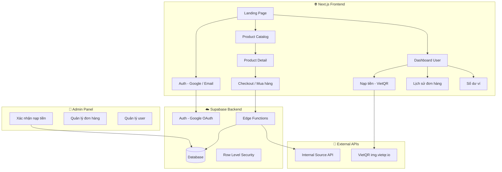
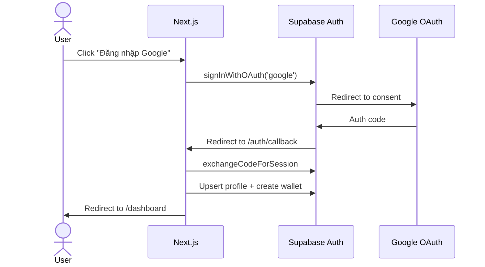
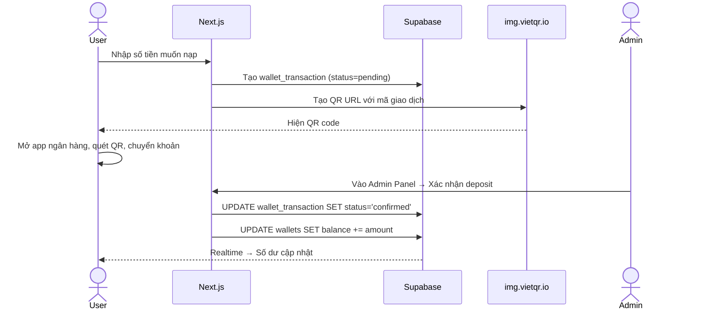
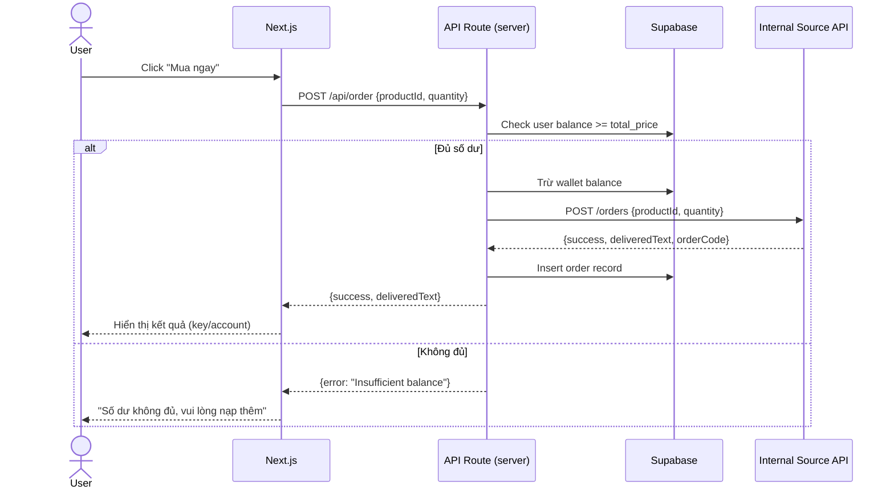

# Web App Bán Hàng Resell — TUANTHOI

## Tổng quan

Xây dựng web app resell sản phẩm từ nguồn ULTRA (Internal Source API — `api.altivoxai.com`), cho phép khách hàng mua sản phẩm số, thanh toán qua VietQR, đăng nhập bằng Google hoặc email, sử dụng Supabase làm backend.

---

## 🔍 Phân tích yêu cầu & Đánh giá tối ưu

### ✅ Những gì đã tối ưu trong yêu cầu
- **Supabase** — lựa chọn tốt cho auth, database, realtime. Không cần tự build backend.
- **Google OAuth** — chuẩn, nhanh, UX tốt.
- **VietQR** — phổ biến nhất tại VN cho thanh toán chuyển khoản.

### ⚠️ Những điểm cần cải thiện & Đề xuất

| Vấn đề | Phân tích | Đề xuất |
|---------|-----------|---------|
| **API Key bị lộ ở client** | API key `isk_1c25adc...` nếu gọi trực tiếp từ browser sẽ bị lộ, bất kỳ ai cũng có thể dùng key để đặt hàng, trừ số dư | ✅ Dùng **Supabase Edge Functions** làm proxy — API key chỉ nằm trên server |
| **Xác nhận thanh toán VietQR** | VietQR Quick Link chỉ tạo QR, **không tự động xác nhận** thanh toán. Phải kiểm tra thủ công hoặc tích hợp webhook ngân hàng | ✅ Tạo flow **semi-auto**: Tạo QR → User chuyển khoản → Admin xác nhận trên dashboard. Hoặc tích hợp **Casso/SePay webhook** để auto xác nhận |
| **Quản lý số dư** | Cần hệ thống wallet nội bộ để user nạp tiền trước, mua hàng trừ dần — tối ưu hơn thanh toán từng đơn | ✅ Tạo bảng `wallets` + `wallet_transactions` trên Supabase. Khi admin xác nhận nạp → cộng số dư |
| **Bảo mật đơn hàng** | User có thể giả mạo request nếu logic nằm ở client | ✅ Toàn bộ logic mua hàng (trừ dư, gọi API đặt hàng, ghi log) chạy trên **Edge Function** |
| **Stack lựa chọn** | Bạn chưa chỉ rõ dùng framework nào | ✅ Đề xuất **Next.js + Supabase** (SSR, SEO tốt, deploy dễ trên Vercel) |

---

## User Review Required

> [!IMPORTANT]
> **API Key bảo mật**: API key `isk_1c25adc3ccbb5631ca681de7505383002c0f23458fdbdd2a` hiện đang nằm trong `doc.md`. Trong production, key này **phải** được lưu trong Supabase Edge Function secrets, **không bao giờ** xuất hiện ở client-side code.

> [!WARNING]
> **Thanh toán VietQR**: VietQR Quick Link (img.vietqr.io) chỉ **tạo mã QR** để user quét và chuyển khoản. Nó **KHÔNG** tự động xác nhận thanh toán. Có 2 hướng xử lý:
> 1. **Manual** (Miễn phí): Admin xác nhận nạp tiền thủ công qua dashboard
> 2. **Auto webhook** (Trả phí): Tích hợp Casso/SePay để nhận webhook khi có biến động số dư → tự động cộng tiền cho user
>
> Tôi sẽ triển khai **hướng 1 (Manual)** trước, có thể bổ sung webhook sau.

> [!IMPORTANT]
> **Thông tin ngân hàng**: Tôi cần thông tin tài khoản ngân hàng của bạn để tạo VietQR:
> - Tên ngân hàng (ví dụ: MB, Vietcombank, Techcombank...)
> - Số tài khoản
> - Tên chủ tài khoản

---

## Open Questions

1. **Tên ngân hàng + Số tài khoản + Tên chủ TK** để tích hợp VietQR?
2. **Tên shop** hiển thị trên web? (mặc định: TUANTHOI Shop)
3. **Giá bán** — bạn muốn đặt giá cố định riêng (markup), hay lấy giá từ catalog API?
4. **Bạn đã có Supabase project chưa?** Nếu chưa, tôi sẽ hướng dẫn tạo.
5. **Deploy ở đâu?** Vercel (miễn phí), Cloudflare Pages, hay self-host?

---

## Kiến trúc hệ thống



---

## Proposed Changes

### Database Schema (Supabase)

#### [NEW] Supabase Tables

```sql
-- Bảng profiles (mở rộng từ auth.users)
CREATE TABLE public.profiles (
  id UUID PRIMARY KEY REFERENCES auth.users(id) ON DELETE CASCADE,
  display_name TEXT,
  email TEXT,
  avatar_url TEXT,
  role TEXT DEFAULT 'user' CHECK (role IN ('user', 'admin')),
  created_at TIMESTAMPTZ DEFAULT now()
);

-- Bảng wallets (số dư ví)
CREATE TABLE public.wallets (
  id UUID PRIMARY KEY DEFAULT gen_random_uuid(),
  user_id UUID UNIQUE NOT NULL REFERENCES public.profiles(id) ON DELETE CASCADE,
  balance BIGINT DEFAULT 0, -- đơn vị VND, dùng BIGINT tránh floating point
  updated_at TIMESTAMPTZ DEFAULT now()
);

-- Bảng giao dịch ví
CREATE TABLE public.wallet_transactions (
  id UUID PRIMARY KEY DEFAULT gen_random_uuid(),
  user_id UUID NOT NULL REFERENCES public.profiles(id),
  type TEXT NOT NULL CHECK (type IN ('deposit', 'purchase', 'refund')),
  amount BIGINT NOT NULL,
  balance_after BIGINT NOT NULL,
  description TEXT,
  reference_code TEXT, -- mã nạp tiền hoặc mã đơn hàng
  status TEXT DEFAULT 'pending' CHECK (status IN ('pending', 'confirmed', 'rejected')),
  confirmed_by UUID REFERENCES public.profiles(id),
  created_at TIMESTAMPTZ DEFAULT now()
);

-- Bảng đơn hàng
CREATE TABLE public.orders (
  id UUID PRIMARY KEY DEFAULT gen_random_uuid(),
  user_id UUID NOT NULL REFERENCES public.profiles(id),
  product_id TEXT NOT NULL,
  product_name TEXT NOT NULL,
  quantity INT NOT NULL DEFAULT 1,
  unit_price BIGINT NOT NULL,
  total_price BIGINT NOT NULL,
  source_order_code TEXT, -- mã đơn từ Internal Source API
  client_order_code TEXT, -- mã nội bộ
  delivered_text TEXT, -- nội dung delivered (account, key, etc.)
  status TEXT DEFAULT 'pending' CHECK (status IN ('pending', 'processing', 'delivered', 'failed', 'refunded')),
  created_at TIMESTAMPTZ DEFAULT now()
);

-- Bảng cached catalog (cache sản phẩm để giảm API calls)
CREATE TABLE public.product_cache (
  id TEXT PRIMARY KEY, -- product ID từ source
  name TEXT NOT NULL,
  description TEXT,
  price BIGINT NOT NULL, -- giá gốc
  sell_price BIGINT, -- giá bán (markup)
  stock INT DEFAULT 0,
  category TEXT,
  image_url TEXT,
  is_visible BOOLEAN DEFAULT true,
  sort_order INT DEFAULT 0,
  last_synced_at TIMESTAMPTZ DEFAULT now()
);
```

---

### Frontend (Next.js)

#### [NEW] Cấu trúc thư mục

```
d:\dev\TUANTHOI-resell\
├── .env.local                    # Supabase keys
├── next.config.js
├── package.json
├── public/
│   └── favicon.ico
├── src/
│   ├── app/
│   │   ├── layout.js             # Root layout + Google Fonts
│   │   ├── page.js               # Landing page
│   │   ├── globals.css           # Global styles + design system
│   │   ├── auth/
│   │   │   ├── callback/
│   │   │   │   └── route.js      # OAuth callback handler
│   │   │   ├── login/
│   │   │   │   └── page.js       # Login page
│   │   │   └── register/
│   │   │       └── page.js       # Register page
│   │   ├── shop/
│   │   │   ├── page.js           # Product catalog grid
│   │   │   └── [productId]/
│   │   │       └── page.js       # Product detail + buy
│   │   ├── dashboard/
│   │   │   ├── page.js           # User dashboard
│   │   │   ├── orders/
│   │   │   │   └── page.js       # Order history
│   │   │   ├── wallet/
│   │   │   │   └── page.js       # Wallet + deposit
│   │   │   └── layout.js         # Dashboard layout (sidebar)
│   │   ├── admin/
│   │   │   ├── page.js           # Admin overview
│   │   │   ├── deposits/
│   │   │   │   └── page.js       # Confirm deposits
│   │   │   ├── orders/
│   │   │   │   └── page.js       # Manage orders
│   │   │   └── layout.js         # Admin layout
│   │   └── api/                  # Next.js API Routes (alternative to Edge Functions)
│   │       ├── catalog/
│   │       │   └── route.js      # Proxy GET /catalog
│   │       ├── order/
│   │       │   └── route.js      # Proxy POST /orders
│   │       └── balance/
│   │           └── route.js      # Proxy GET /balance
│   ├── components/
│   │   ├── ui/                   # Reusable UI components
│   │   │   ├── Button.js
│   │   │   ├── Card.js
│   │   │   ├── Modal.js
│   │   │   ├── Badge.js
│   │   │   └── Input.js
│   │   ├── layout/
│   │   │   ├── Header.js
│   │   │   ├── Footer.js
│   │   │   └── Sidebar.js
│   │   ├── ProductCard.js
│   │   ├── VietQRModal.js        # QR payment modal
│   │   ├── WalletBalance.js
│   │   └── OrderItem.js
│   └── lib/
│       ├── supabase/
│       │   ├── client.js         # Browser Supabase client
│       │   └── server.js         # Server Supabase client
│       ├── source-api.js         # Internal Source API wrapper (server-only)
│       └── utils.js              # Helpers (format currency, etc.)
```

---

### Luồng hoạt động chính

#### Flow 1: Đăng ký / Đăng nhập


#### Flow 2: Nạp tiền


#### Flow 3: Mua hàng


---

### Tính năng UI chính

| Trang | Mô tả |
|-------|-------|
| **Landing** | Hero section ấn tượng, featured products, trust signals |
| **Shop** | Grid sản phẩm với filter/search, giá, tồn kho |
| **Product Detail** | Thông tin chi tiết, nút mua, chọn số lượng |
| **Login/Register** | Google OAuth + Email/Password, UI hiện đại |
| **Dashboard** | Tổng quan: số dư, đơn hàng gần đây, thống kê |
| **Wallet** | Nạp tiền (VietQR), lịch sử giao dịch |
| **Orders** | Danh sách đơn + trạng thái, xem chi tiết delivered text |
| **Admin - Deposits** | Xác nhận/từ chối yêu cầu nạp tiền |
| **Admin - Orders** | Quản lý tất cả đơn hàng |

### Design System
- **Font**: Inter (Google Fonts)
- **Color Palette**: Dark mode primary, với accent gradient xanh-tím (modern SaaS feel)
- **Animations**: Framer Motion cho page transitions, hover effects
- **Glassmorphism** cards, subtle borders, backdrop blur

---

## Verification Plan

### Automated Tests
```bash
npm run build          # Verify no build errors
npm run lint           # ESLint checks
```

### Manual Verification
- ✅ Google OAuth login/logout flow
- ✅ Product catalog loads from Internal Source API
- ✅ VietQR code generates correctly with dynamic amount + reference
- ✅ Admin can confirm deposits → user balance updates
- ✅ User can purchase → Internal Source API called → delivered text shown
- ✅ Responsive design (mobile/tablet/desktop)
- ✅ API key never exposed in client-side code

---

## Tech Stack Summary

| Layer | Technology |
|-------|-----------|
| Framework | **Next.js 14+** (App Router) |
| Auth | **Supabase Auth** (Google OAuth + Email) |
| Database | **Supabase PostgreSQL** |
| API Proxy | **Next.js API Routes** (bảo vệ API key) |
| Payment QR | **VietQR Quick Link** (img.vietqr.io — miễn phí) |
| Styling | **Vanilla CSS** (custom design system) |
| Deployment | **Vercel** (recommended) |
| Realtime | **Supabase Realtime** (cập nhật số dư) |
